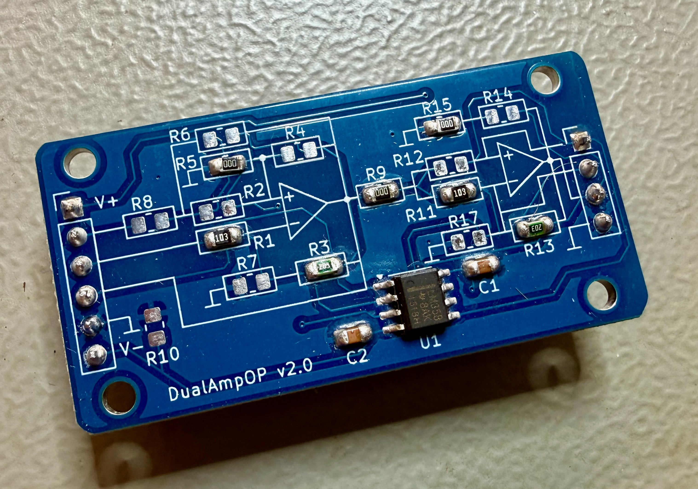

# DualAmpOP

[cschopfer/DualAmpOP](https://github.com/cschopfer/DualAmpOP)

Un petit PCB pour avoir un ampli-op double disponible pour vos bricolages sur breadboard.



**Statut :** prototype v2.0 monté et testé, fonctionne très bien.
Cette v2.0 remplace une v1 qui n'a jamais été produite.

## Le principe

Le PCB accepte tout double ampli-op compatible broche à broche en boîtier
SOIC-8 — LM358, MCP6002, etc.

Chaque étage dispose d'un réseau de résistances (R1 à R8 pour le premier
étage, R9 à R17 pour le second, sur le même principe) qu'il suffit de
câbler pour obtenir la topologie voulue :

- **n.m.** — ne rien monter
- **0 Ω** — un pont (connexion directe)
- **valeur** — une vraie résistance, pour régler un gain ou une fréquence de coupure

## Configurations

| Montage | R1 | R2 | R3 | R4 | R5 | R6 | R7 | R8 | Gain / formule |
|---|---|---|---|---|---|---|---|---|---|
| Inverseur | valeur | n.m. | valeur | n.m. | 0 Ω | n.m. | n.m. | n.m. | `Vout = −Vin·(R3/R1)` |
| Non-inverseur | n.m. | 0 Ω | valeur | n.m. | n.m. | n.m. | valeur | 0 Ω | `Vout = Vin·(1 + R3/R7)` |
| Transimpédance | 0 Ω | n.m. | Rf | n.m. | 0 Ω | n.m. | n.m. | n.m. | `Vout = −Iin·R3` |
| Suiveur | n.m. | 0 Ω | 0 Ω | n.m. | n.m. | n.m. | n.m. | 0 Ω | `Vout = Vin` |
| Passe-bas actif (intégrateur) | R | n.m. | C* | n.m. | n.m. | n.m. | n.m. | n.m. | `fc = 1/(2πRC)` |
| Passe-haut actif | — | — | — | — | — | — | — | — | à venir |
| Sallen-Key | — | — | — | — | — | — | — | — | à venir |

\* Pour les filtres actifs, la résistance concernée est remplacée par un
condensateur céramique 0805 de même taille.

### Alimentation symétrique ou asymétrique

R10 relie le rail V- à la masse.

- **Non montée** : alimentation symétrique (Vcc+ / Vcc-)
- **Montée à 0 Ω** : alimentation asymétrique, entre Vcc et GND

## Arborescence

```
hardware/
  DualAmpOP.kicad_pro
  exports/
    PDF/
    gerbers/
    3D/
docs/
  images/
    IMG_3928.jpeg
```

## Licence

À définir.
